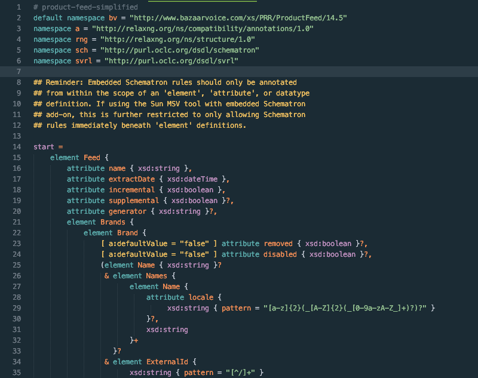

# SublimeRelaxNG
A [RELAX NG Compact](http://relaxng.org/) Syntax for [Sublime Text](http://www.sublimetext.com/).

The example [product-feed-simplified](product-feed-simplified.rnc) file is a condensed schema for Bazaarvoice Product Feeds, meant to show users how the syntax highlighting looks.

For those who want to see without installing:

If making changes to this code, I recommend the following plugins:

* [PackageDev](SublimeText/PackageDev)
* [Scope Hunter](facelessuser/ScopeHunter)